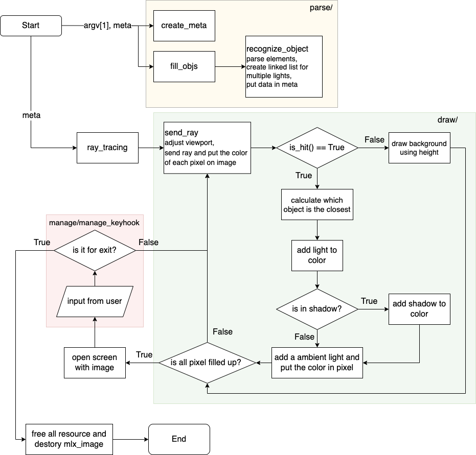

# MiniRT

## **프로젝트 개요**

레이 트레이싱 기법으로 Ambient Light, Light, Camera의 위치, 방향이 적용된 구, 원기둥, 평면을 랜더링한다.

mlx라이브러리를 이용하여 이미지를 띄우고 사용자의 입력을 받는다.

*.rt 파일을 입력으로 받아 요소들의 정보를 얻는다.

**Elements**

Ambient lightning
```
A 0.2 255,255,255
```
- identifier: A
- ambient lighting ratio in range [0.0,1.0]: 0.2
- R,G,B colors in range [0-255]: 255, 255, 255

Camera
```
C -50.0,0,20 0,0,1 70
```
- identifier: C
- x,y,z coordinates of the view point: -50.0,0,20
- 3d normalized orientation vector. In range [-1,1] for each x,y,z axis:
0.0,0.0,1.0
- FOV : Horizontal field of view in degrees in range [0,180]: 70

Light
```
L -0.0,50.0,0.0 0.6 10,0,255
```
- identifier: L
- x,y,z coordinates of the light point: -40.0,50.0,0.0
- the light brightness ratio in range [0.0,1.0]: 0.6
- (unused in mandatory part)R,G,B colors in range [0-255]: 10, 0, 255


Sphere
```
sp 0.0,0.0,20.6 12.6 10,0,255
```
- identifier: sp
- x,y,z coordinates of the sphere center: 0.0,0.0,20.6
- the sphere diameter: 12.6
- R,G,B colors in range [0-255]: 10, 0, 255
7

Plane
```
pl 0.0,0.0,-10.0 0.0,1.0,0.0 0,0,225
```
- identifier: pl
- x,y,z coordinates of a point in the plane: 0.0,0.0,-10.0
- 3d normalized normal vector. In range [-1,1] for each x,y,z axis: 0.0,1.0,0.0
- R,G,B colors in range [0-255]: 0,0,225

Cylinder
```
cy 50.0,0.0,20.6 0.0,0.0,1.0 14.2 21.42 10,0,255
```
- identifier: cy
- x,y,z coordinates of the center of the cylinder: 50.0,0.0,20.6
- 3d normalized vector of axis of cylinder. In range [-1,1] for each x,y,z axis:
0.0,0.0,1.0
- the cylinder diameter: 14.2
- the cylinder height: 21.42
- R,G,B colors in range [0,255]: 10, 0, 255


A, C, L은 꼭 존재해야한다.

## **프로젝트 진행**

- 프로젝트 구조
	```
	miniRT
	├─ Makefile
	├─ include
	│  ├─ get_next_line.h
	│  ├─ libft.h
	│  ├─ miniRT.h
	│  └─ structs.h
	├─ mlx
	└─ src
	├─ draw
	│  ├─ check_hit_cylinder.c
	│  ├─ check_is_hit.c
	│  ├─ draw_light.c
	│  ├─ draw_shadow.c
	│  ├─ ray_trace.c
	│  └─ ray_trace_util.c
	├─ manage
	│  ├─ manage_controller.c
	│  ├─ manage_ctrl.c
	│  ├─ manage_error.c
	│  ├─ manage_keyhook.c
	│  ├─ manage_mlx.c
	│  └─ manage_resource.c
	├─ miniRT.c
	├─ parse
	│  ├─ parse_line.c
	│  ├─ parse_lowercase_type.c
	│  ├─ parse_put_info.c
	│  ├─ parse_uppercase_type.c
	│  └─ parse_utils.c
	├─ util
	│  ├─ ft_count_array.c
	│  ├─ get_next_line.c
	│  └─ libft
	└─ vec
		├─ calculate_basic_vec.c
		├─ calculate_util.c
		├─ calculate_vec.c
		├─ init_attr.c
		└─ rotate_vec.c
	```

- 프로젝트 플로우 차트


## **진행 후**

- 카메라, 빛, 각 오브젝트들을 이동, 회전할 수 있는 지 확인한다.
- 각 빛들의 색이 잘 들어갔는 지 확인한다.
- 스펙큘러를 넣는 과정에서 오류가 없는 지 확인한다.
- 물체 내부에 카메라가 있을 때 내부가 보이는 지 확인한다.
- 메모리 누수가 없는지, 프로그램이 종료될 때 자원이 잘 회수되는 지 확인한다.

어려웠던 점
- 벡터를 이용한 수식을 이해하는 부분이 가장 어려웠다. 원하는 결과가 나오지않으면 결국 디버깅해보며 식을 다 이해해야했다. 하지만 제대로 이해한 뒤 코드를 다시 작성하는 과정에서 전체적인 코드를 더 잘 이해할 수 있었고 드디어 내 코드가 됐다!는 생각이 들었다.

- 휴먼 에러를 찾는 게 너무 ..어려웠다,..
